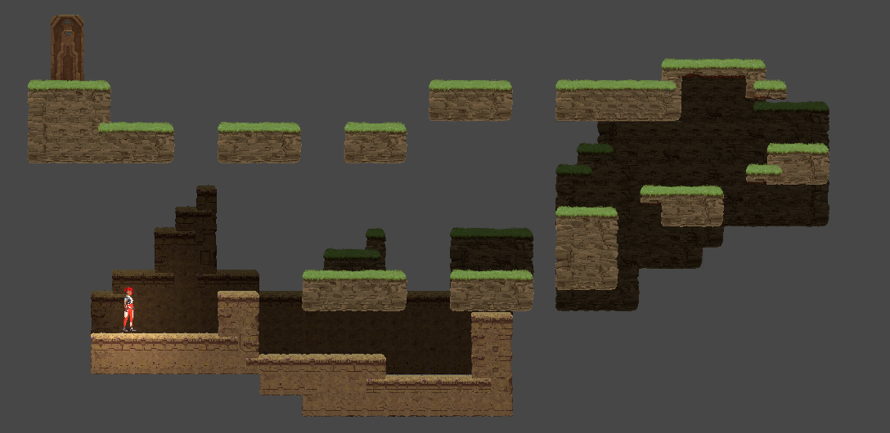
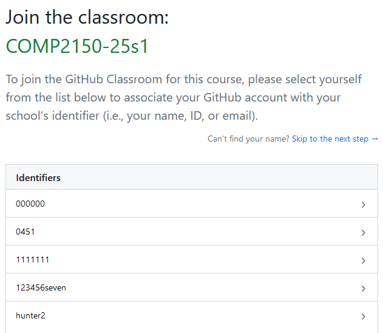
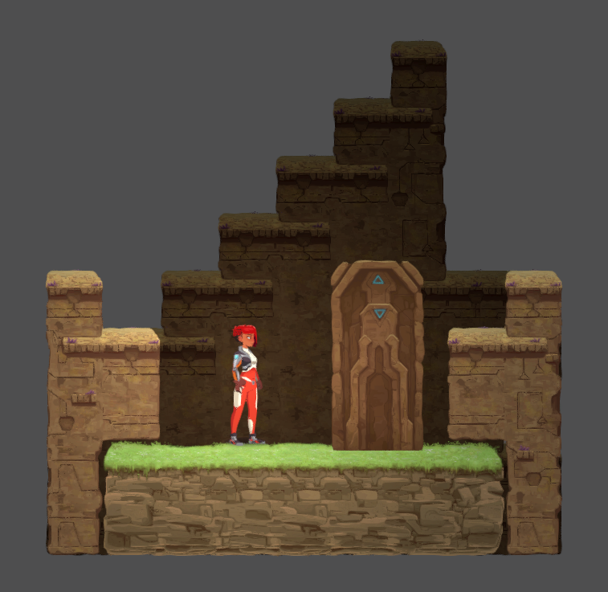
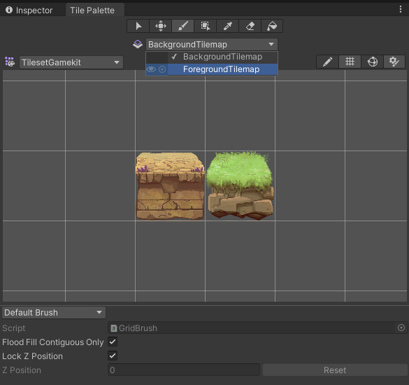

# Week 01 - The 2D Tile Editor

Today will be focused on getting you acquainted with the main tools you'll need for the level design assignment. We will be brushing up on GitHub, and getting familiar with the 2D Tile Editor in Unity. By the end of this worksheet, you should:

* Have your GitHub account linked to your Student ID.
* Know how to clone, commit and push to GitHub repos.
* Understand how to use the 2D Tile Editor to add and remove tiles in Unity.

Don't worry about not getting a "complete" level done today. This is more about introducing you to the tools you'll need for future weeks.

## Tools used
Today's task uses (but is not limited to):

* GitHub Desktop (or your GitHub client of choice)
* Unity

## Assignment deliverable
You will not be directly working on an assignment today, but instead setting up the workflows necessary for the assignment (i.e. using GitHub appropriately).

## GitHub and GitHub Classroom (5 min)
By sheer virtue of the fact you are looking at this lab sheet, you must already have a GitHub account. Woohoo! However, if you haven't used GitHub since last year, you might have forgotten a few things.

### Linking your account and Student ID

When you clicked the link to accept this task, you would have been prompted to select your Student ID from a roster that looks something like this:

This roster is for <b>this unit only</b> and links your GitHub account, meaning we are able to quickly access your work. This will be important for the labs, but also for marking your assignments. If you did not select your Student ID, don't worry. You'll be able to select it next week when you accept that week's lab. If you couldn't find your Student ID, you'll need to contact the staff to have your ID added to the roster before you can select it.

<b>Make sure you've connected your account to your Student ID before the Level Design assignment is due! Failure to do so may result in your assignment not being marked!</b>

### Cloning your repo

Clone this repo onto your work station. Officially, we support GitHub Desktop in this unit, but you can use any GitHub client you'd like.

To clone a repository, open up the GitHub Desktop app. Then, select File > Clone Repository. You should be able to find your repo under the "GitHub.com" tab. If not, you can copy and paste the URL to the repo instead. For more detailed instructions, ask your instructor or refer back to your COMP1150 notes. Remember to note where you are saving your repo!

## Opening the project (5 min)
The repo contains a Unity project. Open this project up using Unity. For this unit, we will be using Unity 2022.3.37f1, which should already be installed on the lab machines (call over your instructor if you are struggling to find it).

If you are working on your own device, you can find this version in the [Unity Archive](https://unity.com/releases/editor/archive).

It is important to use the right version of Unity. Assignments created in the wrong version of Unity will not be marked.

Inside the project is the 2D Game Kit from Unity. In a future week, you'll be provided with the Level Design assignment repo that will use a version of this Game Kit specially set-up for the task.

Rather than letting you get lost in this project, we've created a scene for you to use today. In the Assets > Lab folder, open the Scene "Week 01". You should see something like this:

The scene is relatively empty, with a small platform that the player character "Ellen" is standing on and a door. Your task today will be to use the Tilemap Editor to create a more interesting path for Ellen to navigate from where they start to the door.

## The Tilemap Editor (10 min)

### Tilemap Components
Creating a tilemap requires a few different components. These have all been set-up for you, but it’s a good idea to get familiar with what they do. We won't be diving too deep into the mechanics of the Tilemap Editor in this unit, but you can check out [Unity's resources on it here](https://learn.unity.com/tutorial/introduction-to-tilemaps).

#### Tilemap Sprites
A tilemap is made from a collection of sprites. These sprites are generally stored in a sprite sheet, which is a single image split into many different sprites. You can see the sprite sheet used in this project by navigating to Assets > 2DGameKit > Art > Sprites > Environment > Tilesets > Tileset_Rock.png. You don’t need to alter this file at all, but you can have a look to understand how the tilemap is constructed.

#### Tile Palette
A “tile palette” allows you to select the tiles you want to use and then place them on the screen. Navigate to or open the Tile Palette panel (Window > 2D > Tile Palette). You should see something like this, showing the tiles available to us:

This is one of the two default tile palettes the project comes with, TilesGameKit. The other palette, TilesetRockWatersBlockers can be selected from the drop down in the top left of the Tile Palette panel, but we don’t recommend using this one.

#### Tilemaps
Think of a tilemap as another layer of your scene that you can place tiles on. Your scene already contains two tilemaps: a ForegroundTilemap and a BackgroundTilemap. Any edits made using your Tile Palette will only affect the selected Tilemap. You can change between Tilemaps by selecting them at the top of the Tile Palette panel from the Active Target drop-down.

The Foreground is all the parts of the level that the player can collide with: floors, ceilings, etc. The Background sits behind this, and cannot be collided with. This makes it useful for adding some depth and texture to your level, creating rooms, guiding paths for players, etc.

## Building your level (15 min)

### The toolbar
With your Tilemap Palette Panel open, take a look at the tool bar along the top. You should see seven icons:

<b>The Selection tool (S):</b> Selects an area of tiles in the active tilemap in your scene.

<b>The Move tool (M):</b> Moves selected tiles (note, you need to select the tiles with the selection tool first) on the active tilemap in your scene.

<b>The Brush tool (B):</b> Paint the tile selected in the Tile Palette panel onto the active tilemap in your scene.

<b>The Box tool (U):</b> Paint a rectangle of tiles onto the active tilemap in your scene.

<b>The Pick/Marquee tool (I):</b> Set the brush to a tile from the active tilemap in your scene (instead of selecting it in the Tile Palette panel).

<b>The Erase tool (D):</b> Erase tiles.

<b>The Fill tool (G):</b> Fills an area of the active tilemap in your scene with the selected tile, using the mouse position and current tiles as reference points. 

### Placing and removing tiles
Try creating a few different configurations of tiles using these tools. First, select one of the two tiles in the TilePalette window and try drawing them in your Scene view with the brush tool (note: you cannot add tiles by clicking on the Game view).

The first thing you’ll notice is that as you draw, the tiles will change to correspond to those around them. That is because these are Rule Tiles, which means they are configured to change based on tiles adjacent to them on the same tilemap.

We won't be diving into Rule Tiles here. For now, it's enough to understand and observe how a collection of tiles together will change to appear more cohesive. [Click here for more information on Rule Tiles](https://learn.unity.com/tutorial/using-rule-tiles).

These tools can take a while to master. Get familiar with all these tools, including switching between Tilemaps.

To stop editing the tilemap, you either need to close the window or select one of the scene transformation tools (View, Move, Rotate, etc) in the scene view. It can be a bit fiddly, so make sure you are doing this a few times to get the hang of it.

Note: You can quickly delete tiles by holding down the Shift key while using the Brush or Box tool.

Build a small level with a few areas for the player to navigate. Try out different shapes and configurations. Using the scene editing tools, move the Door object (under "Environment" in the hierarchy) to the "end" of your level.

Note: The Tilemap has a `Tilemap Collider 2D`. This can slow down editing when the map gets large. It may be a good idea to simply deactivate the collider while editing the tiles if your computer has issues, just don’t forget to reactivate it when you’re done.

### Saving, committing and pushing your work
Don't forget to save, commit and push your work. This was a good habit to get into in COMP1150, and a good one to stick with this semester! Call over your instructor if you've forgotten how to do this.

## Playing the level (20 min)
Once you've got something you think you can run around in, make sure Ellen is at the start of the level and hit play. You can control Ellen with the following controls:

| Keyboard control	| Action performed |
|-----|----|
A/D	|  Move left/right
Space	| Jump
S	|  Crouch

The player can be controlled using a keyboard. We will introduce you to additional controls/commands in future weeks, as well as gamepad controls, but for now we just want to be running and jumping.

Play through your level a bit and see what you think. Does the layout make sense? Can the player make all the jumps you've created, or are they sometimes too far/narrow?

### Reflect & Iterate
With the remaining time, keep iterating on your level to try and create something interesting for your player to navigate. Don't forget to save, commit and push your work regularly.

## Next Week
Next week, we will be getting our peers to play our small levels and getting to grips with iteration in our game design workflow.