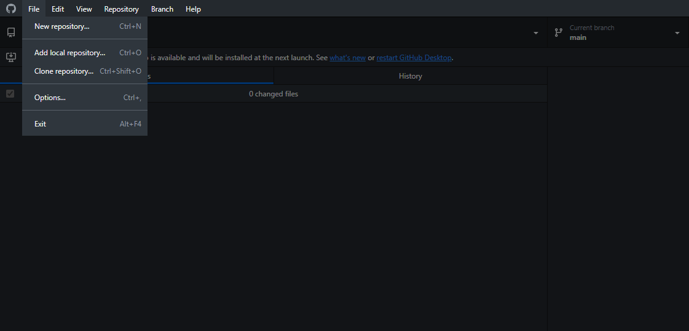

# Week 01 - Github, Unity and The 2D Tile Maker
Today will be focused on a refresher of Github, Unity and an introduction to the 2D Tile Maker in Unity, a tool that you will need to use for your Level Design assignment. By the end of this worksheet, you should:

* Have your Github account linked to your Student ID.
* Know how to clone, commit and push to Github repos.
* Understand how to create a simple scene using the 2D Tile Maker.

## Tools used
Today's task uses (but is not limited to):

* Github Desktop (or your Github client of choice)
* Unity

## Assignment deliverable
You will not be directly working on an assignment today, but instead setting up the workflows necessary for the assignment (i.e. using Github appropriately).

## Github and Github Classroom
By sheer virtue of the fact you are looking at this lab sheet, you must already have a Github account. Woohoo! However, if you haven't used Github since last year, you might have forgotten a few things.

### Linking your account and Student ID

When you clicked the link to accept this task, you would have been prompted to select your Student ID from a roster that looks something like this:

~[Image of the roster](images/roster.png)

This roster is for <b>this unit only</b> and links your Github account, meaning we are able to quickly access your work. This will be important for the labs, but also for marking your assignments. If you did not select your Student ID, don't worry. You'll be able to select it next week when you accept that week's lab. However, if you couldn't find your Student ID, you'll need to contact the staff to have your ID added to the roster before you can select it.

<b>Make sure you've connected your account to your Student ID before the Level Design assignment is due! Failure to do so may result in your assignment not being marked!</b>

### Cloning, committing, pushing

If you haven't already, clone this repo onto your device. Officially, we support Github Desktop in this unit, but you can use any Github client you'd like. However, these steps will assume the use of Github Desktop.

To clone a repository, open up the Github Desktop app. Then, select File > Clone Repository. You should be able to find your repo under the "Github.com" tab. If not, you can copy and paste the URL to the repo instead. For more detailed instructions, ask your instructor or refer back to your COMP1150 notes. Remember to note where you are saving your repo to!

Once you have the repository on your computer, navigate to it. Inside will be a Unity project, as well as this Readme file. Let's try editing the readme file. Open the file up in Visual Studio Code and replace the below text with the name of your favourite video game:

===REPLACE ME!===

Once you've done that, save the file and head back into Github Desktop. You should see 

Description of a particular part of the task.

Using the 2D Game Kit
Open the Unity project inside the repository. It contains four folders:

2DGameKit: The default assets for the project, including sprites, scripts, etc. You shouldn’t modify anything in this folder.

Prefabs: The Required and Optional features for your game. You shouldn’t modify any of these prefabs, but should be using them when building your level.

Examples: This folder contains two scenes: A Sample Scene and a Prefab Demonstration scene. Both are worth investigating and playing with to learn how the various elements of the project work.

Scenes: This folder contains two scenes: an End of Game scene (that you don’t need to modify) and a Level Design scene, which is the scene you will be building your level in. The scene contains the three keys and door that you will need to include in your final level, so you can relocate them to fit your design.

If you accidentally delete your scene, you can create a new one by pressing Kit Tools > Create Template Scene… > Create Template Scene in Assets. Don’t forget to rename this scene to “Level Design”.
Tilemap Tutorial
Before you can get started on the assignment, you will need to learn a new tool which will help you develop your levels: Tilemaps.

Tilemaps are a feature in Unity that makes building 2D tile-based games easier. Many games represent the world as a 2D grid of tiles. Laying out these tiles manually can be very tedious. The Tilemap editor streamlines this process.

You will use Tilemaps to create your level’s basic geometry, so it is important you get familiar with the tool. Unity Learn also hosts a great tutorial series covering this feature, which you can find here.

The project provided to you already has the tilemap set-up, so you only need to worry about placing tiles. However, if you want more in-depth knowledge of how to create a tilemap from scratch, please see the document on iLearn entitled “Bonus: Tilemaps From Scratch”.
Tilemap Components
Creating a tilemap requires a few different components. These have all been set-up for you, but it’s a good idea to get familiar with what they do.
Tilemap Sprites
A tilemap is made from a collection of sprites. These sprites are generally stored in a sprite sheet, which is a single image split into many different sprites. You can see the sprite sheet used in this project by navigating to Assets > 2DGameKit > Art > Sprites > Environment > Tilesets > Tileset_Rock.png. You don’t need to alter this file at all, but you can have a look to understand how the tilemap is constructed. It should look like this in the Inspector:
 
Tile Palette
A “tile palette” can be thought of like a painter’s colour palette, where they select different colours to paint onto the canvas. The tile palette allows you to select the tiles you want to use and then place them on the screen. We’re going to come back to how to do this, but for now you can navigate to or open the Tile Palette panel (Window > 2D > Tile Palette). You should see something like this, showing the tiles available to us:

 
This is one of the two default tile palettes the project comes with, TilesGameKit. The other palette, TilesetRockWatersBlockers can be selected from the drop down in the top left of the Tile Palette panel, but we don’t recommend using this one.
Tilemaps
To add tiles to the scene, we need a tilemap. Think of a tilemap as another layer of your scene that you can place tiles on. Your scene already contains two tilemaps: a Foreground Tilemap and a Background Tilemap. Any edits made using your Tile Palette will only effect the selected Tilemap. You can change between Tilemaps by selecting them at the top of the Tile Palette panel from the Active Target drop-down.

 

These two tilemaps may appear the same, but have distinct properties. The Background Tilemap contains no colliders, and will draw tiles a darker colour at the back of your scene, so you can use this to add more depth to your level. The Foreground Tilemap will be drawn at the front of your scene, and these tiles have colliders. This allows you to create the geometry of your level.

Note that you can also select your tilemaps in the hierarchy. Be careful when working on your project that you don’t accidentally select the wrong tilemap, always double-check your Active Tilemap is set to the one you want before making changes.
Using the Tilemap Tool
Now that you’ve been introduced to the various elements of the Tilemap Tool, it’s time to explore how to use it. With your Tilemap Palette Panel open, take a look at the tool bar along the top. You should see seven icons:

 

These tools are as follows:
●	The Selection tool (S): Selects an area of tiles in the active tilemap in your scene.
●	The Move tool (M): Moves selected tiles (note, you need to select the tiles with the selection tool first) on the active tilemap in your scene.
●	The Brush tool (B): Paint the tile selected in the Tile Palette panel onto the active tilemap in your scene.
●	The Box tool (U): Paint a rectangle of tiles onto the active tilemap in your scene.
●	The Pick/Marquee tool (I): Set the brush to a tile from the active tilemap in your scene (instead of selecting it in the Tile Palette panel).
●	The Erase tool (D): Erase tiles.
•	The Fill tool (G): Fills an area of the active tilemap in your scene with the selected tile, using the mouse position and current tiles as reference points. 

Try creating a few different configurations of tiles using these tools. First, select one of the two tiles in the TilePalette window and try drawing them in your Scene view with the brush tool (note: you cannot add tiles by clicking on the Game view).

The first thing you’ll notice is that as you draw, the tiles will change to correspond to those around them. That is because these are Rule Tiles, which means they are configured to change based on tiles adjacent to them on the same tilemap (a rule tile on the Foreground Tilemap will not respond to a tile on the Background Tilemap, and vice versa). 

You can take a look at the rules for these tiles by navigating to Assets > 2DGamekit > Art > TilemapPalettes > Tileset and selecting either Tileset Alien Rules or Tileset Rock Rules and viewing them in the inspector. You should see something like this:

 

It’s a good idea to get a handle on how this works, to the extent of understanding why a certain tile might look the way it does. However, if you want to learn how to create your own Rule Tiles, see the “Bonus: Tilemaps From Scratch” document on iLearn.

These tools can take a while to master. Experiment by drawing a scene using the tiles. Get familiar with all these tools, including switching between Tilemaps.

To stop editing the tilemap, you need to close the Tilemap Palette panel (it’s annoying, we know). Make sure you do this before you start placing your prefabs, or you might edit your tilemap unintentionally. You can open the panel again when you want to edit your tilemap. 

Note: You don’t have to ever select the Erase tool, as you can simply hold Shift while using the Brush or Box tool. As a result, you can erase large areas quickly by selecting the Box tool and holding shift while drawing a box. Give it a try, but be careful using it to delete large areas, as it is quite resource intensive and can (rarely) cause Unity to lag.
Controls
The player can be controlled using a keyboard or gamepad. You can switch between these two input methods by selecting the Ellen prefab (Assets > 2DGamekit > Prefabs > Ellen) and setting the Input Type in the Player Input component in the Inspector. Do not modify these controls, as your marker will be working with multiple projects and not have time to learn new schemes each assignment.

 

Keyboard control	Gamepad control	Action performed
A/D	Left analog stick	Move left/right
Space	B	Jump
S	Down on the D-pad	Crouch (combine with jump to move through a Passthrough Platform)
K	A	Swing staff (after pickup)
O	Right bumper	Shoot gun (after pickup)
The Hierarchy
The hierarchy is set up to contain all the important components to make the game work. You shouldn’t need to worry about most of these. Objects immediately underneath ---System---, cannot be children of a parent, as they contain helper code components that utilize something called DontDestroyOnLoad, such as the background music or the inventory. 

The main elements you should familiarise yourself with are:
1.	Ellen: The player character, found under ---PlayerAssets---. You shouldn’t need to change any of their settings, but you can place them at whatever starting point you want.
2.	Tilemap:  The tilemaps for the scene. These can be found under ---LevelAssets--- > Environment > TileMapGrid. We have included two tilemaps for you: the Foreground Tilemap for creating the main geometry of your level, and a Background Tilemap for adding background flourishes to give your level more depth and a sense of place.

Note: The Tilemap has a Composite Collider 2D. This can slow down editing when the map gets large. It may be a good idea to simply deactivate the collider while editing the tiles if your computer has issues, just don’t forget to reactivate it when you’re done.

3.	---LevelAssets---: This is where you should put the elements that make up your scene. You can add them as children, or add them immediately underneath this empty GameObject. 

### Reflect
Include a section on reflection to ensure students are doing something with their knowledge in the moment.

## Next Week
Next week, we will be getting our peers to play our small levels and getting to grips with iteration in our game design workflow.
